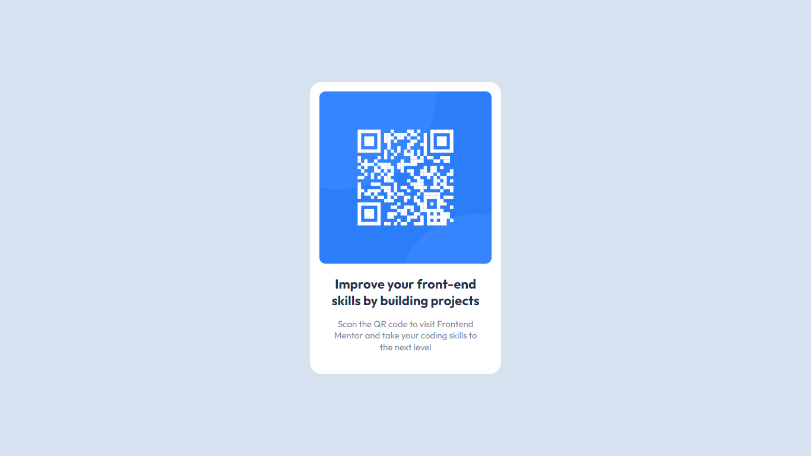

# Frontend Mentor - QR code component solution

This is a solution to the [QR code component challenge on Frontend Mentor](https://www.frontendmentor.io/challenges/qr-code-component-iux_sIO_H). Frontend Mentor challenges help you improve your coding skills by building realistic projects. 

## Table of contents

- [Overview](#overview)
  - [Screenshot](#screenshot)
  - [Links](#links)
- [My process](#my-process)
  - [Built with](#built-with)
  - [Useful resources](#useful-resources)
- [Author](#author)

## Overview

### Screenshot

### Links

- Solution URL: [Solution URL](https://your-solution-url.com)
- Live Site URL: [Live Site URL](https://your-live-site-url.com)

## My process

### Built with

- Semantic HTML5 markup
- CSS custom properties
- Flexbox

### Useful resources

- [CSS Reset](https://meyerweb.com/eric/tools/css/reset/) - This helped me for reseting default styling that each browser apply to html files and Helped my projects styling be cosistent in all different browesers.

- [Google Fonts](https://fonts.google.com/) - This is an amazing resource for beautiful and Free Fonts for your projects.

## Author

- Frontend Mentor - [@yourusername](https://www.frontendmentor.io/profile/theamiralizadeh)
- Linkedin - [@amir-alizadeh](https://www.linkedin.com/in/amir-alizadeh/)